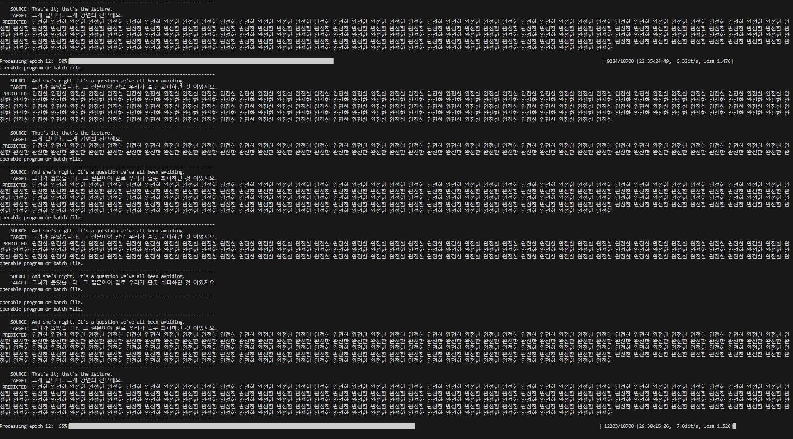

# English to Korean Translation using Transformers

This repository contains code for a word-level translation model from English to Korean using transformer models.

## Model Architecture

The transformer model used for this project is implemented in the `model.py` file. The model leverages the transformer architecture to translate English sentences to Korean at the word level.

## Dataset

The dataset used for training the model is from the Hugging Face repository:
[Korean-English Multitarget TED Talks Task](https://huggingface.co/datasets/msarmi9/korean-english-multitarget-ted-talks-task).

## Training

The training process is implemented in the `training.py` file. This script handles loading the data, training the transformer model, and evaluating its performance.

### How to Train the Model

1. Clone the repository:
    ```sh
    git clone https://github.com/Nirmal-Adhikari-hub/Transsformer_to_report.git
    cd Transsformer_to_report
    ```

2. Install the required dependencies:
    ```sh
    pip install -r requirements.txt
    ```

3. Run the training script:
    ```sh
    python training.py
    ```

### Evaluation

The `run_validation()` function within the `training.py` script is used to evaluate the model's performance on the validation set.

## Inference

The `tests.ipynb` notebook contains code to run inference using the trained model. You can find examples of translating English sentences to Korean using the model.

### How to Run Inference

1. Open the `tests.ipynb` file in Jupyter Notebook or Jupyter Lab.
2. Run the cells to load the trained model and translate sample sentences.

## Performance Metrics

Below is a snapshot of the training process displaying the loss value:



## File Structure

- `model.py`: Contains the implementation of the transformer model.
- `training.py`: Contains the code for training and evaluating the model.

## Usage

To use the model for translation, follow these steps:

1. Ensure you have the necessary dependencies installed.
2. Modify the `model.py` or `training.py` if you need to change any model parameters or training configurations.
3. Run the training script to train the model on the provided dataset.

## Contributing

Contributions are welcome! Please feel free to submit a Pull Request.

## License

This project is licensed under the MIT License.

## Acknowledgements

- [Hugging Face Datasets](https://huggingface.co/datasets/msarmi9/korean-english-multitarget-ted-talks-task) for providing the dataset.
